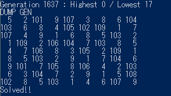

# SudokuGA_CS

This program will solve the particular type of Sudoku quiz by GA.  

Usage: SudokuGA.exe question.txt  
(if you build on VS Mac then, mono SudokuGA.exe path_to_question)  

This program depends on hints' number whether it can solve it or not.  
Maybe a quiz contains over 23 hints (experimentally), this program can solve the quiz. Rarely this can solve quiz 17 (minimum) hints but such cases are rare and unstable.   
I guess experts could figure out the better way on each GA process, making mutants, how to cross over and estimating fitness.  

